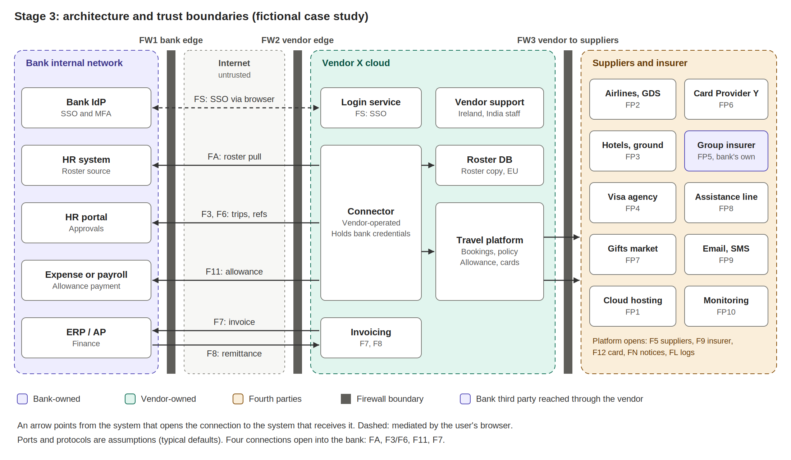

# TPRM case study: onboarding a travel SaaS vendor at a bank

> **Fictional case study.** Example Bank and Vendor X are placeholders. All vendor answers, evidence, dates and scores are simulated. Nothing here is based on a real organisation, vendor or assessment. Legal and standard references are indicative and should be checked against the official texts. This is not legal or compliance advice. Drafted with AI assistance, then reviewed and decided by the author.
>
> **Status:** Confirmed by author.

## What this is

A learning project in third-party risk management (TPRM). It follows one vendor through the whole onboarding workflow, from the business reason to a risk decision, and shows how each step connects to the next.

**The scenario:** Example Bank, an EU-headquartered bank with operations in Asia, wider EMEA, and the US and Mexico, wants to use Vendor X, a corporate travel management platform delivered as SaaS. The platform connects to the bank's HR system, identity provider, finance system and group insurer. It handles passport data, executive itineraries, daily allowances, virtual cards and guest bookings.

## The method in one line

**Flow or observation, then risk, then control requirement, then framework reference, then question, then vendor answer, finding and decision.**

Every item carries an ID, so a reader can follow any thread from the architecture diagram to the decision (see `traceability-matrix.xlsx`).

## The five stages

| Stage | Question it answers | Main deliverable |
|---|---|---|
| 1. Scoping and inherent risk | Why do we use this vendor, what data is involved, how critical is it, and which rules apply? | `01-scoping/scoping-and-inherent-risk.md` |
| 2. Vendor profile | Who are they, what do they claim, and who are their suppliers? | `02-vendor/vendor-profile.md` |
| 3. Architecture and data flow | How do the two parties connect, where are the trust boundaries, which paths are exposed? | `03-architecture/architecture-and-data-flows.md` and the diagram |
| 4. Control requirements | What must be true, derived from risks first and mapped to frameworks second? | `04-controls/control-requirements.md` and the questionnaire workbook |
| 5. Assessment and decision | What did we find, how big is the residual risk, and what do we decide? | `05-assessment/` |

## Architecture



Arrows point from the system that opens the connection to the system that receives it. Four connections open into the bank, all from the vendor cloud, and the invoice path bypasses the connector. These two facts drove many of the questions in Stage 4.

## Three ways to read the same case

| Perspective | Question | Where to look | Answer in this case |
|---|---|---|---|
| **TPRM** | Should we onboard this vendor? | `05-assessment/decision-memo.md` | Conditional approval. Not approved until the pre-go-live conditions are verified |
| **ISO 27001** | Which controls apply and what evidence do we expect? | The *ISO 27001 view* sheet in `04-controls/vendor-questionnaire-and-control-map.xlsx` | 39 Annex A controls tested, each tied to control requirements, questions and expected evidence |
| **IT risk and GRC** | What residual risk remains and how is it governed? | The *Risk register* and *Monitoring* sheets in `05-assessment/assessment-workbook.xlsx` | Two Very high and four High risks today. None above Medium after remediation. Thirteen key risk indicators and an annual reassessment |

The ISO 27001 view is a coverage view of the controls this assessment tests. It is not a Statement of Applicability and not an ISMS implementation.

## Headline results (simulated)

| Item | Result |
|---|---|
| Classification | Critical or important function, Tier 1, treated as outsourcing as well as an ICT service |
| Inherent risk | Very high (25 of 27) |
| Questionnaire | 87 questions in 20 domains, 28 control requirements. 64 priority questions assessed: 24 Satisfactory, 32 Partial, 8 Gap |
| Findings | 22: 5 High, 16 Medium, 1 Low |
| Risks | 17 in the register. 2 Very high and 4 High today. No risk above Medium after the agreed remediation |
| Decision | Conditional approval: close the High findings and the contract conditions before go-live, keep the AI assistant and virtual cards off until verified, and finish the Medium actions within 90 days |
| Assessment dashboard | 05-assessment/dashboard.png |

## Repository map

```
tprm-travel-saas-case-study/
├── README.md
├── traceability-matrix.xlsx          flow to decision, one row per thread
├── 01-scoping/
│   └── scoping-and-inherent-risk.md
├── 02-vendor/
│   └── vendor-profile.md
├── 03-architecture/
│   ├── architecture-and-data-flows.md
│   ├── network-architecture.png
│   └── network-architecture.svg
├── 04-controls/
│   ├── control-requirements.md
│   └── vendor-questionnaire-and-control-map.xlsx
└── 05-assessment/
    ├── assessment-overview.md
    ├── assessment-workbook.xlsx      answers, findings, risks, actions, monitoring
    ├── decision-memo.md              includes the management summary
    └── incident-scenario.md          tabletop: stolen connector credential
    └── dashboard.png                 The KRIs only start after go-live
```

## How to read it

- **In 10 minutes:** this page, then `decision-memo.md`, then the first rows of `traceability-matrix.xlsx`.
- **In 30 minutes:** the five stages in order, then the Findings and Risk register sheets.
- **For the method:** follow thread T-01 in the traceability matrix from the architecture to the decision.

## What the case study demonstrates

1. **Scoping before questions.** Inherent risk, criticality and applicable rules decide how deep the assessment goes.
2. **Claims are not evidence.** Each vendor statement is a claim until evidence is seen, and evidence is rated by strength.
3. **Architecture drives the questions.** The flow table shows who opens each connection, which boundary it crosses and which data moves.
4. **Controls come from risks.** Frameworks (DORA, GDPR, ISO 27001) are mapped afterwards, not used as a starting checklist.
5. **Critical is not the same as risky.** A service can be high in data risk and still be assessed against what the bank cannot do without. The reasoning is written down.
6. **A frozen baseline with a change log.** An AI provider found late (change PF-1) is recorded in Stage 5 without rewriting the earlier stages.
7. **Decision rules set before judging.** High findings close before go-live, Medium findings within 90 days, and the memo explains how each risk is treated (mitigate, avoid, transfer or accept).
8. **Monitoring after the decision.** Indicators and a reassessment schedule, because a Tier 1 vendor is never finished at onboarding.

## Limitations

- The vendor, the evidence and the dates are invented. The value is in the method.
- Likelihood and impact are scored by judgement and are not calibrated with data.
- Ports, protocols and some defaults (90-day credential rotation, 24-hour incident notice, 90-day guest retention) are proposed assumptions.
- Regulatory references are at article or control level and are indicative. DORA, GDPR, NIS2, the EBA outsourcing guidelines and ISO/IEC 27001 should be checked against the official texts.
- A real bank's process, thresholds and approvals would differ.

## Feedback

Corrections and comments are welcome, especially from TPRM, compliance and security practitioners. Please open an issue.

## Licence

Content is released under CC BY 4.0. You may share and adapt it with attribution. See `LICENSE`.

## Author

Yogesh Gandal 
Drafted with AI assistance (Claude, by Anthropic). The scenario, decisions and review are by the author.
